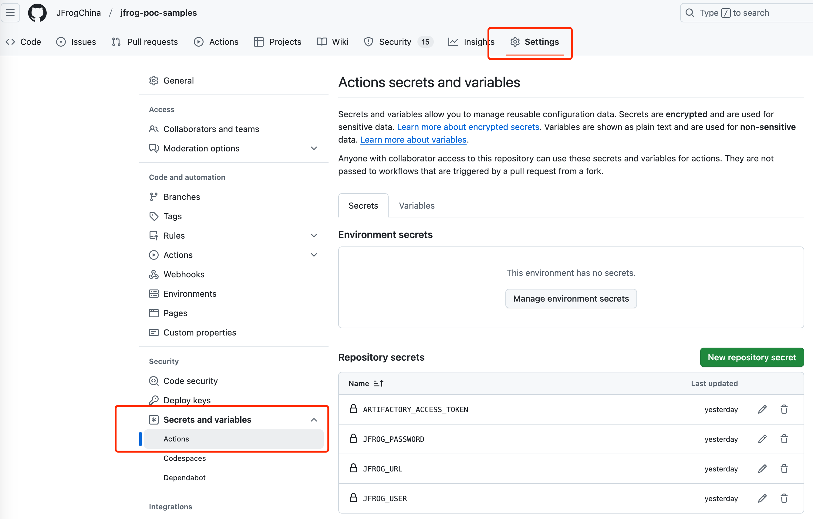

# project-example

## Review the existing dependency in .csproj
```
<PackageReference Include="Newtonsoft.Json" Version="13.0.3" />
```

## Add Artifactory as remote repository
 nuget sources Add -Name Artifactory -Source https://art-server/artifactory/api/nuget/v3/alex-nuget/index.json -username user -password pwd

Check the source has been added
```
nuget sources
```
## Download dependency
```
 dotnet restore
```

## Build package
```
dotnet pack
```

## Upload to Artifactory
```
 nuget push bin\Release\MyProject.1.0.0.nupkg -Source Artifactory
 ```

## Curation test

### Create condition to block the nuget package
Go to Administrator->Curation Settings-> Condition -> Create Condition
Create a condition called "block-nuget" to match this package:
System.Text.Encodings.Web 4.5.0

### Create Policy to block this package
Go to Application-> Curation -> Policies -> Create Policy
Create policy called "block-nuget"
Add the "block-nuget" condition as this policy's condition, and use the "Block" in the action&Notification step.
Then save the policy. 

### Try download the blocked dependecy 
In the  project .csproj file, add below line:
```
    <PackageReference Include="System.Text.Encodings.Web" Version="4.5.0" />
```
Save and execute the command: 
```
dotnet restore
```
or add it from the command line.
```
dotnet add package System.Text.Encodings.Web --version 4.5.0
```

## Integrate with Github Action
### Refer to the action file

1. Create variable and secret for GH action.



2. Open the file: .github/workflows/dotnet-desktop.yml
Replace the variable and secret with your own.

3. Review the build result

